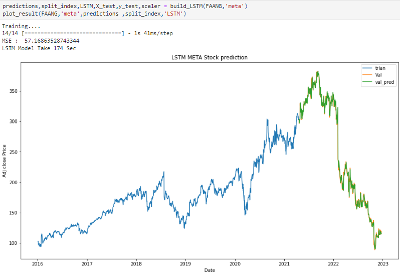

# Investment and Trading Capstone Project

## Project Overview
Investment firms, hedge funds, and even individuals have been using 
financial models to understand market behavior better and make profitable investments and trades. A wealth of information is available in the form of historical stock prices and company performance data, suitable for machine learning algorithms to process.  
People need money to have what they need to live and thrive, but what do you need to be happy? Also money but a lot of it. One of the ways to get a lot of money is through investment, and why invest? Investing is an effective way to put your money to work and create potential wealth. Investing allows your money to outpace inflation and increase in value. You may need a lot of money to retire early, retire with more money, or make a big purchase like buying a house, buying your dream car, or traveling the world, all of which means happiness.  
Financial modeling tries to predict the future price of the stocks by learning their historical price
over years. So, in this project, I will build a stock price predictor by using a machine learning
algorithm that takes daily trading data from the yahoo finance website over a certain date range
as input (Adj Close), and outputs projected estimates for a given query date. The system will
predict the adjusted closing price for the selected stock and for different time periods, as well as
portfolio optimization taking the amount of money you intend to invest in the market and
making a mix of stocks that maximizes the Sharpe Ratio, minimizes volatility or maximizes
return using Efficient Frontier.

## Installations
The following libraries are needed to successfully run the project.
I used python 3 for this project and other packages installed are:
  
*   pandas
*   pandas-datareader
*   numpy
*   matplotlib
*   scikit-learn
*   keras
*   pyportfolioopt
*   yfinance
*   plotly

you can just run this command `pip install -r requirements.txt`

 ## Files 
 This project has the following files:
 1. **nasdaq_screener.csv:** This contain the mega and large companies ticker, name and sector used for download the data get from [NASDAQ website](https://www.nasdaq.com/market-activity/stocks/screener)
 2. **Stock price predictor & portfolio opt.ipynb:** This is the jupyter notebook that containing the code.
 3. **Report.pdf** This is the report for this project discuss all steps
 4. **program script.py** this contain the project functions that can be used throw CLI

## Results Summary
## Testing

### Mean Squared Error 

### Predictions

We can see that we can predict the future prices of stocks just by looking at their historical prices, there are many ML models that can predict stock prices.  
Sometimes we found LSTM outperforms the LR model but LR is generally better on this type of data, only the adjusted closing price has been used with these preprocessing techniques and LR is better because of less error and less time < 1 second. LSTM can work better on other
data types such as using all the features from the dataset such as open, high, low, and close prices.

## Portfolio Optimization

### Max Sharpe ratio

### Min Risk

### Max Return

By using the [PyPortfolioOpt](https://github.com/robertmartin8/PyPortfolioOpt) library to build a diversified portfolio and using the [portfolio visualizer](https://www.portfoliovisualizer.com/backtest-portfolio) site for backtesting the portfolio using the adjusted close price data of 193 tickers for
mega and large companies from 2016 to 2018 for making a portfolio and backtest this portfolio for 2019, we found
*   The Max Sharpe ratio portfolio achieved 21% more than expected with the same risk in the
backtest and with a close Sharpe ratio
*   The Min Risk Portfolio achieved a double return from 12.5% as expected to 27% and lower risk than expected and with a higher Sharpe ratio
*   The Max Return portfolio from 88% expected, it achieved 148% return with lower risk from
70% to 38% and Sharpe ratio 2.56 in the backtest but still very risky
  
A detailed code and analysis can be found in the Jupyter notebook **Stock price predictor & portfolio opt.ipynb** and in the [Report](Report.pdf).  

### Acknowledgments
This project is a capstone project of [AWS Machine Learning Engineer Nanodegree](https://www.udacity.com/course/aws-machine-learning-engineer-nanodegree--nd189) program. 
[Machine Learning for Trading course](https://www.udacity.com/course/machine-learning-for-trading--ud501) was helpful for understanding stock market terminology and techniques.

